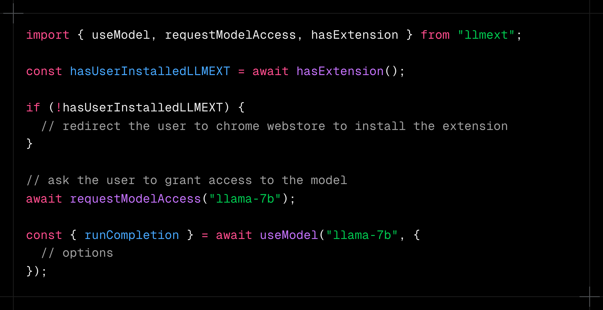

## what ?

a browser extension that downloads and manages all the local models (eg: llms/whisper/segment anything) and provides a nice api for websites to build using them.
( basically ollama as an extension )

- can bypass the 2gb size limitation for caching when loading normally ( i need to test this, but i think that is normally the case )

- won't be affected by the different eviction policies browsers implement when using normal web storage apis.

- all the websites can share the same models. so truely download once scenario.

- easier to install + better UX than installing an app. Add to chrome is literally one click.

- support for all the operating systems, because this is the web

## Sample API ( zeroth version, came up with this in 2 minute )

